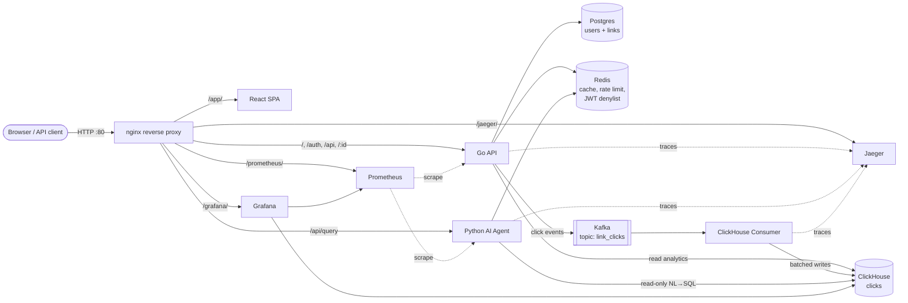

# URL Shortener — Distributed Analytics Platform

A production-style URL shortener built as a learning project. It is **not** just a "paste a link, get a short link" toy — it is a full distributed system: a Go REST API, an event pipeline (Kafka → ClickHouse), an AI analytics agent that answers questions about your traffic in plain English (Google Gemini, natural language → SQL), a React dashboard, and a complete observability stack (Prometheus, Grafana, Jaeger). The whole thing runs with **one command** via Docker Compose.

> **TL;DR — run it locally**
> ```bash
> cp .env.example .env          # then edit .env (see "Configuration")
> docker compose up -d --build  # first build ~5–10 min
> ```
> Open **http://localhost/app/** → register an account → shorten a link.

---

## Table of contents

1. [What it does](#1-what-it-does)
2. [Architecture](#2-architecture)
3. [Tech stack](#3-tech-stack)
4. [Prerequisites — what you need](#4-prerequisites--what-you-need)
5. [Quick start (local)](#5-quick-start-local)
6. [Configuration (`.env`)](#6-configuration-env)
7. [Where everything lives (URLs & ports)](#7-where-everything-lives-urls--ports)
8. [Using the app](#8-using-the-app)
9. [API reference](#9-api-reference)
10. [The AI analytics agent](#10-the-ai-analytics-agent)
11. [Observability](#11-observability)
12. [Development & testing](#12-development--testing)
13. [Project structure](#13-project-structure)
14. [Deploying to a server](#14-deploying-to-a-server)
15. [Troubleshooting](#15-troubleshooting)
16. [License](#16-license)

---

## 1. What it does

- **Shorten URLs** behind your own domain/host, with optional **custom aliases**.
- **Accounts & auth** — register / login with JWT; logout is honored server-side via a Redis denylist.
- **Fast redirects** — short codes are cached in Redis; redirects work even if downstream analytics is degraded.
- **Click analytics** — every redirect emits a click event (timestamp, country, device, referrer, bot flag, …) onto Kafka, which a consumer batches into ClickHouse for fast aggregate queries.
- **AI analytics** — ask questions like *"how many clicks did I get from Germany last week?"* in the UI; a Gemini-backed agent turns it into validated, read-only, user-scoped SQL and runs it against ClickHouse.
- **Per-link analytics dashboard** in the UI, plus operator dashboards in Grafana (click volume, geo distribution, device breakdown, bot traffic, top referrers, link leaderboard, system health).
- **Observability built in** — Prometheus metrics, Grafana dashboards, and end-to-end distributed tracing in Jaeger across the Go API, the consumer, and the Python agent.
- **Defense in depth** — per-IP rate limiting (auth / redirect / API / AI), a read-only DB user for the AI agent, SQL validation, and internal services bound to localhost so all public traffic must pass through nginx.

---

## 2. Architecture

Everything is fronted by a single nginx reverse proxy on port **80**. Application services (Go API, Python agent) are bound to `127.0.0.1` only — the outside world reaches them exclusively through nginx, which sets a trusted `X-Real-IP` so rate limiting and the IP blacklist can't be bypassed.



**The click pipeline:** a visitor hits `GET /{short_id}` → Go API looks up the target (Redis, falling back to Postgres) → issues the redirect → asynchronously publishes a click event to Kafka → the consumer batches events and writes them to ClickHouse → Grafana and the AI agent read from ClickHouse. The redirect never blocks on analytics.

### Services

| Service | Image / Build | Role | Internal port |
|---|---|---|---|
| **nginx** | `nginx:1.31-alpine` | Reverse proxy; the single public entrypoint | 80 |
| **frontend** | built (`frontend/`) | React SPA (served by an internal nginx) | 80 |
| **go-api** | built (`backend/shortener/`) | REST API: auth, shorten, redirect, per-link analytics | 8080 (+9091 metrics) |
| **python-agent** | built (`python-agent/`) | AI analytics agent (NL → SQL via Gemini) | 8090 (+9093 metrics) |
| **clickhouse-consumer** | built (`clickhouse-consumer/`) | Kafka consumer → ClickHouse writer | (9094 metrics) |
| **postgres** | `postgres:17-alpine` | Source of truth: users + links | 5432 |
| **redis** | `redis:8-alpine` | Cache, rate-limit counters, JWT logout denylist | 6379 |
| **kafka** + **zookeeper** | `confluentinc/cp-*:7.6` | Click-event stream (topic `link_clicks`) | 9092 |
| **clickhouse** | `clickhouse/clickhouse-server:26.5-alpine` | Analytics store (`clicks` table) | 8123 / 9000 |
| **prometheus** | `prom/prometheus:v3.11` | Metrics scraping & storage | 9090 |
| **grafana** | `grafana/grafana:13.1` | Dashboards (provisioned automatically) | 3000 |
| **jaeger** | `jaegertracing/all-in-one:1.76` | Distributed tracing | 16686 / 4318 |

---

## 3. Tech stack

- **Backend API** — Go, [chi](https://github.com/go-chi/chi) router, [pgx](https://github.com/jackc/pgx) (Postgres), [golang-migrate](https://github.com/golang-migrate/migrate) for migrations, OpenTelemetry, structured `slog` logging.
- **AI agent** — Python, [FastAPI](https://fastapi.tiangolo.com/), Pydantic, Google Gemini, ClickHouse + Redis clients, OpenTelemetry.
- **Consumer** — Go, Kafka consumer, batched ClickHouse writes.
- **Frontend** — React 18, Vite 5, Tailwind CSS 3, React Router 6, axios, Recharts; tested with Vitest + Testing Library.
- **Data** — Postgres (transactional), ClickHouse (analytical, column-store), Redis (cache/locks), Kafka (event bus).
- **Ops** — Docker Compose; Prometheus / Grafana / Jaeger; Terraform (DigitalOcean) for cloud deploys; GitHub Actions CI.

---

## 4. Prerequisites — what you need

**To run the whole stack, the only hard requirement is Docker.** Everything else listed under "Development" is optional and only needed if you want to run a single service outside containers.

| Requirement | Needed for | Notes |
|---|---|---|
| **Docker Engine ≥ 24** + **Docker Compose v2** | Running the stack | `docker compose version` should work. Docker Desktop on Windows/macOS includes both. |
| **~8 GB free RAM** | Running the stack | Kafka + ClickHouse + Grafana + Prometheus are the heavy parts. 4 GB will struggle. |
| **~10 GB free disk** | Images + data volumes | |
| **A Google Gemini API key** | The AI Analytics agent | Free tier is plenty. Get one at https://aistudio.google.com/apikey. *Without it, everything else works — only the AI agent page fails.* |
| **A MaxMind GeoLite2 license** *(optional)* | Country data on clicks | Free signup at https://www.maxmind.com/en/geolite2/signup. *Without it, redirects still work but `country` is blank and the geo dashboard is empty.* See [§5.4](#54-optional-add-geoip-country-data). |

You do **not** need Go, Node, or Python installed to run the project — they live inside the Docker images.

---

## 5. Quick start (local)

### 5.1 Get the code
```bash
git clone https://github.com/NikitaPash/url-shortener.git
cd url-shortener
```

### 5.2 Create your `.env`
The root `.env` is the single source for all deployment secrets.
```bash
cp .env.example .env
```
Open `.env` and set real values. **At minimum, change every `change_me_in_production`** and paste your Gemini key. See [§6](#6-configuration-env) for the full reference. A reasonable local-dev `.env`:

```dotenv
POSTGRES_PASSWORD=devpassword
JWT_SECRET=dev-only-change-me-please-32-chars-min
ADMIN_EMAIL=admin@example.com
ADMIN_PASSWORD=adminpassword
CLICKHOUSE_DATABASE=shortener
CLICKHOUSE_USER=default
CLICKHOUSE_PASSWORD=devpassword
CLICKHOUSE_ANALYST_PASSWORD=devpassword-ro
KAFKA_TOPIC=link_clicks
GEMINI_API_KEY=your_real_gemini_key_here
GEMINI_MODEL=gemini-2.5-flash-lite
BASE_URL=http://localhost
GRAFANA_PASSWORD=admin
```

> 💡 Generate strong secrets with `openssl rand -hex 32`. For anything internet-facing, do **not** keep the example values.

### 5.3 Start everything
```bash
docker compose up -d --build
```
The first build downloads images and compiles the Go services, the agent, and the frontend — budget **~5–10 minutes**. Later starts are fast.

There is also a `Makefile` wrapper if you prefer:
```bash
make up        # docker compose up -d
make rebuild   # docker compose up -d --build
make ps        # docker compose ps
make logs      # docker compose logs -f --tail=50
make down      # docker compose down
```

### 5.4 (Optional) Add GeoIP country data
Skip this if you don't need country breakdowns. With a MaxMind license key:
```bash
LICENSE=<your_maxmind_license_key>
curl -sL "https://download.maxmind.com/app/geoip_download?edition_id=GeoLite2-Country&license_key=${LICENSE}&suffix=tar.gz" -o /tmp/geo.tar.gz
mkdir -p backend/shortener/data
tar -xzf /tmp/geo.tar.gz --strip-components=1 -C backend/shortener/data --wildcards '*/GeoLite2-Country.mmdb'
docker compose up -d --build go-api   # rebuild so the DB is baked into the image
```
On Windows without `tar`/`curl`, download the `GeoLite2-Country` `.mmdb` from the MaxMind portal manually and drop it at `backend/shortener/data/GeoLite2-Country.mmdb`.

### 5.5 Verify it's up
```bash
docker compose ps                 # all services "running"; most become "healthy" within ~30–60s
curl -s http://localhost/healthz  # 200 OK (nginx → go-api liveness)
```
Then open **http://localhost/app/** in your browser.

### 5.6 Stop it
```bash
docker compose down       # stop, keep data
docker compose down -v    # stop AND wipe all volumes (DESTRUCTIVE: deletes users, links, analytics)
```

---

## 6. Configuration (`.env`)

All deployment configuration lives in the root `.env` (copied from `.env.example`). Docker Compose injects these into the services.

| Variable | Required | Default (example) | What it controls |
|---|:---:|---|---|
| `POSTGRES_PASSWORD` | ✅ | — | Postgres password used by the Go API. Use a strong random value. |
| `JWT_SECRET` | ✅ | — | Signs & verifies user JWTs. **Shared** by the Go API and the Python agent — they must match. Use `openssl rand -hex 32`. |
| `ADMIN_EMAIL` | optional | `admin@example.com` | Seeds an admin account on startup. Gates the **Admin Panel** in the UI. Leave blank to skip seeding. |
| `ADMIN_PASSWORD` | optional | — | Password for the seeded admin. **Reset to this value on every Go API restart.** |
| `CLICKHOUSE_DATABASE` | ✅ | `shortener` | ClickHouse database name. Keep the default. |
| `CLICKHOUSE_USER` | ✅ | `default` | ClickHouse **write** user (used by the consumer). |
| `CLICKHOUSE_PASSWORD` | ✅ | — | Password for the write user. |
| `CLICKHOUSE_ANALYST_PASSWORD` | ✅ | — | Password for the dedicated **read-only** `analyst` user the AI agent and per-link analytics connect as. Keep it separate from the write password. |
| `KAFKA_TOPIC` | ✅ | `link_clicks` | Topic for click events. Keep the default. |
| `GEMINI_API_KEY` | ✅* | — | Powers the AI agent. *Required only for the AI Analytics page; the rest of the app runs without it.* |
| `GEMINI_MODEL` | optional | `gemini-2.5-flash-lite` | Any available Gemini model. |
| `BASE_URL` | ✅ | `http://localhost` | Public root URL used to build the short links returned to clients. For a deployed instance use `https://yourdomain.com` or `http://<server-ip>`. |
| `GRAFANA_PASSWORD` | ✅ | `admin` | Password for the Grafana `admin` login. |

> Each Go/Python service also ships a `*.env.example` in its own directory — those are only for running that one service **outside** Docker during development (see [§12](#12-development--testing)). For the normal Docker workflow you only touch the root `.env`.

**Tunable defaults baked into the Go API** (override via the service environment if you ever need to): rate limits — `RATE_LIMIT_AUTH=10`, `RATE_LIMIT_REDIRECT=100`, `RATE_LIMIT_API=30` (requests/min/IP); `JWT_EXPIRY=24h`; `DB_MAX_CONNS=10`. The AI endpoint is additionally throttled by nginx to **20 requests/min/IP**.

---

## 7. Where everything lives (URLs & ports)

With `BASE_URL=http://localhost`, go through nginx (port 80) for everything:

| What | URL |
|---|---|
| **Web app (SPA)** | http://localhost/app/ |
| **Short links / redirects** | http://localhost/{short_id} |
| **REST API** | http://localhost/api/… , http://localhost/auth/… |
| **AI analytics endpoint** | http://localhost/api/query |
| **Grafana** | http://localhost/grafana/ — login `admin` / `$GRAFANA_PASSWORD` |
| **Prometheus** | http://localhost/prometheus/ |
| **Jaeger (tracing)** | http://localhost/jaeger/ |
| **Health check** | http://localhost/healthz |

Several backing services also publish host ports for direct inspection during local dev: Postgres `:5432`, Redis `:6379`, Kafka `:9092`, ClickHouse `:8123` (HTTP) / `:9000` (native), Grafana `:3000`, Prometheus `:9090`, Jaeger `:16686`. The Go API (`:8080`) and Python agent (`:8090`) are intentionally bound to `127.0.0.1` only.

---

## 8. Using the app

1. **Open** http://localhost/app/.
2. **Register** a new account (or **log in** with the seeded admin: `ADMIN_EMAIL` / `ADMIN_PASSWORD`).
3. **Create a link** — paste a long URL, optionally set a custom alias. You get back a short URL like `http://localhost/abc123`.
4. **Test the redirect** — open the short URL (or `curl -i http://localhost/abc123`). It 301/302s to the target and records a click.
5. **View analytics** — the dashboard shows your links; open a link's analytics page for its click breakdown.
6. **Ask the AI** — go to the **Analytics** page and ask a question in plain English (e.g. *"top 5 referrers in the last 7 days"*). Available to any logged-in user; results are scoped to your own links only.
7. **Admin Panel** (`/admin`) — visible only to the seeded admin account.

> Click data flows through Kafka → the consumer → ClickHouse, so brand-new clicks can take a few seconds to appear in analytics. Redirects themselves are instant.

---

## 9. API reference

Base URL (local): `http://localhost`. Authenticated endpoints expect `Authorization: Bearer <token>`.

| Method | Path | Auth | Purpose | Rate limit (per IP) |
|---|---|:---:|---|---|
| `POST` | `/auth/register` | — | Create an account | 10/min |
| `POST` | `/auth/login` | — | Log in, returns a JWT | 10/min |
| `POST` | `/auth/logout` | ✅ | Invalidate the current JWT (Redis denylist) | 30/min |
| `POST` | `/api/shorten` | ✅ | Create a short link (optional custom alias) | 30/min |
| `GET`  | `/api/links` | ✅ | List your links | 30/min |
| `GET`  | `/api/links/{id}/analytics` | ✅ | Analytics for one link | 30/min |
| `GET`  | `/{short_id}` | — | Redirect to the target URL (records a click) | 100/min |
| `POST` | `/api/query` | ✅ | Ask the AI agent a question | 20/min (nginx) |
| `GET`  | `/healthz` | — | Liveness | — |
| `GET`  | `/readyz` | — | Readiness (checks Postgres + Redis) | — |

### Example flow

```bash
# 1) Register (or log in) — returns a JWT
TOKEN=$(curl -s -X POST http://localhost/auth/login \
  -H 'Content-Type: application/json' \
  -d '{"email":"admin@example.com","password":"adminpassword"}' | jq -r '.token')

# 2) Shorten a URL
curl -s -X POST http://localhost/api/shorten \
  -H "Authorization: Bearer $TOKEN" \
  -H 'Content-Type: application/json' \
  -d '{"url":"https://example.com/a/very/long/path","custom_alias":"promo"}'

# 3) Follow the short link (records a click)
curl -i http://localhost/promo

# 4) Ask the AI agent
curl -s -X POST http://localhost/api/query \
  -H "Authorization: Bearer $TOKEN" \
  -H 'Content-Type: application/json' \
  -d '{"question":"how many clicks did I get in the last 7 days?"}'
```

> The exact request/response JSON shapes are defined in `backend/shortener/internal/handler/` (Go API) and `python-agent/app/models/schemas.py` (agent). The web UI is the easiest way to exercise everything.

---

## 10. The AI analytics agent

The **Analytics** page lets any logged-in user ask natural-language questions about their traffic. Behind the scenes (`python-agent/`):

1. **Authenticate** — the request's JWT is verified (signature, expiry, and the shared logout denylist).
2. **Generate** — the question + schema context is sent to **Gemini**, which returns a SQL query (or flags the question as off-topic).
3. **Validate** — a SQL validator rejects anything that isn't a safe, single, read-only `SELECT`.
4. **Scope & execute** — the query is forced to the authenticated user's `user_id` and run against ClickHouse as a **read-only** user, with row and time limits.
5. **Return** — the answer comes back as columns + rows, along with the SQL and a short explanation.

Safety properties worth noting: the agent connects to ClickHouse as a dedicated **read-only** `analyst` user (it physically cannot write), every query is **user-scoped at the DB layer** (you only ever see your own clicks), and the endpoint is rate-limited at nginx since each call costs a Gemini request.

There's also an evaluation harness at `python-agent/evaluation/` (`run_eval.py` + `benchmark.json`) for measuring NL→SQL quality.

---

## 11. Observability

- **Grafana** (http://localhost/grafana/) — dashboards are auto-provisioned: click volume, geo distribution, device breakdown, bot traffic, top referrers, link leaderboard, and system health. Datasources (ClickHouse + Prometheus) are wired up automatically.
- **Prometheus** (http://localhost/prometheus/) — scrapes metrics from the Go API and Python agent.
- **Jaeger** (http://localhost/jaeger/) — end-to-end traces spanning nginx → Go API → Kafka → consumer → ClickHouse, and the agent's NL→SQL path.

A deeper guide to the metrics and dashboards lives in [`metrics.md`](metrics.md).

---

## 12. Development & testing

The Docker workflow above is all you need to *run* the project. For working on individual services:

### Run the test suites
```bash
make test
```
This runs the Go API tests, the consumer tests, and the agent's pytest suite. Running it directly requires the Go toolchain and [uv](https://docs.astral.sh/uv/) installed locally; otherwise run tests inside the service containers. Individually:
```bash
cd backend/shortener && go test ./...      # Go API
cd clickhouse-consumer && go test ./...     # consumer
cd python-agent && uv run pytest tests/ -v  # agent  (uv syncs deps from pyproject.toml/uv.lock automatically)
```
The agent's deps are managed with **uv** (`python-agent/pyproject.toml` + `uv.lock`); `uv run` provisions the venv on first use. The pytest run prints a unit-test coverage report (via `pytest-cov`); `make coverage` also writes a browsable HTML report to `python-agent/htmlcov/`.

### Frontend
The frontend is built and served via Docker — there's no local Node required for normal use. To work on it with hot reload you can install deps and run Vite locally:
```bash
cd frontend
npm install
npm run dev        # Vite dev server
npm test           # Vitest unit/component tests
```

### Per-service env files
Each Go/Python service has its own `.env.example` for running it standalone (pointing at `localhost` infra rather than Docker DNS names). Copy to `.env` in that service's directory when developing outside Compose.

### CI
GitHub Actions workflows live in `.github/workflows/` (`code-check.yml` for lint/test, `ci-cd.yml` for the pipeline). Go linting is configured via `.golangci.yml` in each Go module.

---

## 13. Project structure

```
url-shortener/
├── docker-compose.yml          # The whole stack (start here)
├── .env.example                # Single source of all secrets — copy to .env
├── Makefile                    # up / down / rebuild / logs / ps / test
├── deployment.md               # Full server-deploy guide (DigitalOcean / any Docker host)
├── metrics.md                  # Observability guide
│
├── backend/shortener/          # Go REST API
│   ├── cmd/shortener/main.go   #   entrypoint: wiring, routes, graceful shutdown
│   ├── internal/               #   handler / service / storage / middleware / cache / event / geo / telemetry
│   └── migrations/             #   SQL migrations (auto-applied on startup)
│
├── clickhouse-consumer/        # Go: Kafka → ClickHouse writer
├── python-agent/               # FastAPI AI agent (NL → SQL via Gemini) + evaluation harness
├── frontend/                   # React + Vite + Tailwind SPA
│
├── nginx/                      # Reverse proxy config (single public entrypoint)
├── clickhouse/                 # init.sql + user definitions (write + read-only analyst)
├── kafka/                      # topic-creation script
├── redis/                      # redis.conf
├── prometheus/                 # scrape config
├── grafana/provisioning/       # datasources + dashboards (auto-loaded)
└── terraform/                  # DigitalOcean infra-as-code (optional cloud deploy)
```

---

## 14. Deploying to a server

For a full walkthrough — provisioning a VM with Terraform on DigitalOcean (or deploying to any Docker host), wiring a domain, adding TLS, security hardening, and backups — see **[`deployment.md`](deployment.md)**.

The short version: it's the same `docker compose up -d --build` on a Linux host with ~8 GB RAM, port 80 open, and a properly filled-in `.env` (strong secrets, `BASE_URL` set to your public URL). The `terraform/` directory can provision the VM, firewall, and a reserved IP for you.

---

## 15. Troubleshooting

| Symptom | Likely cause | Fix |
|---|---|---|
| AI Analytics page returns an error / 500 | Missing or invalid `GEMINI_API_KEY` | Set a valid key in `.env`, then `docker compose up -d python-agent`. Check `docker compose logs python-agent`. |
| Geo dashboard empty; every `country` is blank | GeoIP database not installed | See [§5.4](#54-optional-add-geoip-country-data), then `docker compose up -d --build go-api`. |
| Short links come back as `http://localhost/...` on a server | `BASE_URL` not set to the public URL | Edit `.env`, `docker compose up -d go-api`. |
| Can't log in as admin | `ADMIN_EMAIL` / `ADMIN_PASSWORD` not set | Add them to `.env`, `docker compose up -d go-api`; look for `admin user ensured` in logs. |
| New clicks don't show in analytics immediately | Async Kafka → consumer → ClickHouse pipeline | Wait a few seconds and refresh. |
| A service is "unhealthy" right after start | Still warming up (Kafka/ClickHouse are slow to boot) | Give it 30–60s; check `docker compose ps` and `docker compose logs <service>`. |
| Port already in use (80/5432/3000/…) | Another process owns the port | Stop the conflicting process, or remap the port in `docker-compose.yml`. |
| Out-of-memory / containers killed | < 8 GB available to Docker | Increase Docker's memory limit (Docker Desktop → Settings → Resources). |

More deployment-specific troubleshooting is in [`deployment.md`](deployment.md).

---

## 16. License

See [`LICENSE`](LICENSE).
