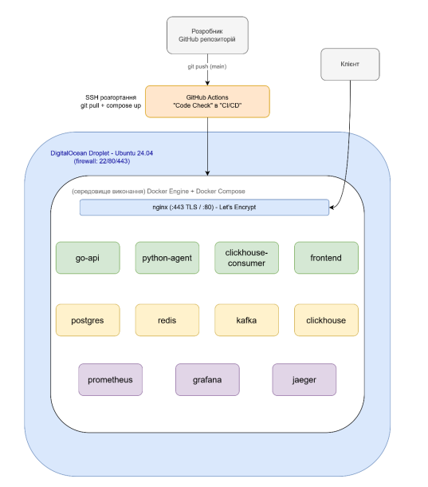

# URL Shortener — розподілена платформа аналітики

Скорочувач посилань у production-стилі, створений як навчальний проєкт. Це **не** іграшка «вставив довге посилання — отримав коротке», а повноцінна розподілена система: REST API мовою Go, конвеєр подій (Kafka → ClickHouse), AI-агент аналітики, що відповідає на запитання про ваш трафік звичайною мовою (Google Gemini, природна мова → SQL), React-дашборд і повний стек спостережуваності (Prometheus, Grafana, Jaeger). Уся система запускається **однією командою** через Docker Compose.

> **Коротко — запустити локально**
> ```bash
> cp .env.example .env          # для локалу дефолтні значення працюють як є
> docker compose up -d --build  # перша збірка ~5–10 хв
> ```
> Відкрийте **http://localhost/app/** → зареєструйте акаунт → скоротіть посилання.

---

## Зміст

1. [Що це вміє](#1-що-це-вміє)
2. [Архітектура](#2-архітектура)
3. [Технологічний стек](#3-технологічний-стек)
4. [Передумови — що потрібно](#4-передумови--що-потрібно)
5. [Швидкий старт (локально)](#5-швидкий-старт-локально)
6. [Конфігурація (`.env`)](#6-конфігурація-env)
7. [Де що живе (URL та порти)](#7-де-що-живе-url-та-порти)
8. [Користування застосунком](#8-користування-застосунком)
9. [Довідник API](#9-довідник-api)
10. [AI-агент аналітики](#10-ai-агент-аналітики)
11. [Спостережуваність](#11-спостережуваність)
12. [Розробка та тестування](#12-розробка-та-тестування)
13. [Структура проєкту](#13-структура-проєкту)
14. [Розгортання на сервері](#14-розгортання-на-сервері)
15. [Усунення несправностей](#15-усунення-несправностей)
16. [Ліцензія](#16-ліцензія)

---

## 1. Що це вміє

- **Скорочення URL** під вашим власним доменом/хостом, з опційними **користувацькими аліасами**.
- **Акаунти та автентифікація** — реєстрація / вхід за JWT; вихід підтверджується на боці сервера через denylist у Redis.
- **Швидкі перенаправлення** — короткі коди кешуються в Redis; перенаправлення працюють навіть якщо аналітика нижче по конвеєру деградувала.
- **Аналітика кліків** — кожне перенаправлення породжує подію кліку (мітка часу, країна, пристрій, реферер, прапорець бота тощо) в Kafka, а консюмер пакетно записує її в ClickHouse для швидких агрегатних запитів.
- **AI-аналітика** — ставте запитання на кшталт *«скільки кліків з Німеччини я отримав минулого тижня?»* прямо в інтерфейсі; агент на базі Gemini перетворює їх на перевірений, лише-для-читання, прив'язаний до користувача SQL і виконує його проти ClickHouse.
- **Дашборд аналітики по кожному посиланню** в інтерфейсі, плюс операторські дашборди в Grafana (обсяг кліків, географія, розподіл пристроїв, трафік ботів, топ реферерів, рейтинг посилань, стан системи).
- **Вбудована спостережуваність** — метрики Prometheus, дашборди Grafana та наскрізне розподілене трасування в Jaeger через Go API, консюмер і Python-агента.
- **Глибока оборона (defense in depth)** — рейт-лімітинг по IP (авторизація / перенаправлення / API / AI), окремий read-only користувач БД для AI-агента, валідація SQL і внутрішні сервіси, прив'язані до localhost, тож увесь публічний трафік мусить проходити через nginx.

---

## 2. Архітектура

Усе публічне стоїть за єдиним зворотним проксі nginx на порту **80**. Застосункові сервіси (Go API, Python-агент) прив'язані лише до `127.0.0.1` — зовнішній світ дістається до них винятково через nginx, який виставляє довірений `X-Real-IP`, тож рейт-ліміт та IP-чорний список неможливо обійти.


**Конвеєр кліків:** відвідувач звертається до `GET /{short_id}` → Go API шукає ціль (Redis, з відкатом до Postgres) → видає перенаправлення → асинхронно публікує подію кліку в Kafka → консюмер пакетує події та записує їх у ClickHouse → Grafana й AI-агент читають із ClickHouse. Перенаправлення **ніколи не блокується** на аналітиці.

### Сервіси

| Сервіс | Образ / Збірка | Роль | Внутрішній порт |
|---|---|---|---|
| **nginx** | `nginx:1.31-alpine` | Зворотний проксі; єдина публічна точка входу | 80 |
| **frontend** | збірка (`frontend/`) | React SPA (обслуговується внутрішнім nginx) | 80 |
| **go-api** | збірка (`backend/shortener/`) | REST API: автентифікація, скорочення, перенаправлення, аналітика по посиланню | 8080 (+9091 метрики) |
| **python-agent** | збірка (`python-agent/`) | AI-агент аналітики (NL → SQL через Gemini) | 8090 (+9093 метрики) |
| **clickhouse-consumer** | збірка (`clickhouse-consumer/`) | Консюмер Kafka → запис у ClickHouse | (9094 метрики) |
| **postgres** | `postgres:17-alpine` | Джерело істини: користувачі + посилання | 5432 |
| **redis** | `redis:8-alpine` | Кеш, лічильники рейт-ліміту, denylist виходу JWT | 6379 |
| **kafka** + **zookeeper** | `confluentinc/cp-*:7.6` | Потік подій кліків (топік `link_clicks`) | 9092 |
| **clickhouse** | `clickhouse/clickhouse-server:26.5-alpine` | Сховище аналітики (таблиця `clicks`) | 8123 / 9000 |
| **prometheus** | `prom/prometheus:v3.11` | Збір та зберігання метрик | 9090 |
| **grafana** | `grafana/grafana:13.1` | Дашборди (провіжняться автоматично) | 3000 |
| **jaeger** | `jaegertracing/all-in-one:1.76` | Розподілене трасування | 16686 / 4318 |

---

## 3. Технологічний стек

- **Бекенд API** — Go, роутер [chi](https://github.com/go-chi/chi), [pgx](https://github.com/jackc/pgx) (Postgres), [golang-migrate](https://github.com/golang-migrate/migrate) для міграцій, OpenTelemetry, структуроване логування `slog`.
- **AI-агент** — Python, [FastAPI](https://fastapi.tiangolo.com/), Pydantic, Google Gemini, клієнти ClickHouse + Redis, OpenTelemetry.
- **Консюмер** — Go, консюмер Kafka, пакетні записи в ClickHouse.
- **Фронтенд** — React 18, Vite 5, Tailwind CSS 3, React Router 6, axios, Recharts; тестується через Vitest + Testing Library.
- **Дані** — Postgres (транзакційна БД), ClickHouse (аналітична, колонкова), Redis (кеш/лічильники), Kafka (шина подій).
- **Ops** — Docker Compose; Prometheus / Grafana / Jaeger; Terraform (DigitalOcean) для хмарних розгортань; GitHub Actions CI.

---

## 4. Передумови — що потрібно

**Щоб запустити весь стек, єдина обов'язкова вимога — Docker.** Усе інше з розділу «Розробка» опційне й потрібне лише якщо ви хочете запускати окремий сервіс поза контейнерами.

| Вимога | Для чого | Примітки |
|---|---|---|
| **Docker Engine ≥ 24** + **Docker Compose v2** | Запуск стеку | `docker compose version` має працювати. Docker Desktop для Windows/macOS містить обидва. |
| **~8 ГБ вільної RAM** | Запуск стеку | Kafka + ClickHouse + Grafana + Prometheus — найважчі частини. На 4 ГБ буде важко. |
| **~10 ГБ вільного диска** | Образи + томи даних | |
| **Ключ Google Gemini API** | AI-агент аналітики | Безкоштовного тарифу більш ніж достатньо. Отримати: https://aistudio.google.com/apikey. *Без нього все інше працює — не працюватиме лише сторінка AI-аналітики.* |
| **Ліцензія MaxMind GeoLite2** *(опційно)* | Дані про країну в кліках | Безкоштовна реєстрація: https://www.maxmind.com/en/geolite2/signup. *Без неї перенаправлення працюють, але `country` лишається порожнім, а гео-дашборд — порожній.* Див. [§5.4](#54-опційно-додати-geoip-дані-про-країну). |

Вам **не** потрібні встановлені Go, Node чи Python, щоб запустити проєкт — вони живуть усередині Docker-образів.

> **Користувачам Windows / PowerShell:** `cp` працює як аліас (`Copy-Item`), тож команди `cp .env.example .env` коректні. А ось `curl` у PowerShell — це аліас до `Invoke-WebRequest`; для прикладів із `curl` нижче використовуйте **`curl.exe`** (він є у Windows 10/11) або просто відкрийте URL у браузері. Сама команда `docker compose up -d --build` однакова всюди.

---

## 5. Швидкий старт (локально)

### 5.1 Отримати код
```bash
git clone https://github.com/NikitaPash/url-shortener.git
cd url-shortener
```

### 5.2 Створити `.env`
Кореневий `.env` — єдине джерело всіх секретів розгортання.
```bash
cp .env.example .env
```
**Для локальної розробки дефолтні значення з `.env.example` працюють як є** — нічого міняти не обов'язково. Єдине опційне доповнення: щоб працювала сторінка AI-аналітики, впишіть свій ключ Gemini:
```dotenv
GEMINI_API_KEY=ваш_справжній_ключ_gemini
```
Повний перелік змінних — у [§6](#6-конфігурація-env).

> 💡 Для будь-чого, що дивиться в інтернет (продакшн), згенеруйте сильні секрети через `openssl rand -hex 32` і **не** лишайте значення `change_me_in_production`. Для локального запуску це не потрібно.

### 5.3 Запустити все
```bash
docker compose up -d --build
```
Перша збірка завантажує образи й компілює Go-сервіси, агента та фронтенд — закладіть **~5–10 хвилин**. Подальші запуски швидкі.

Якщо зручніше — є обгортка `Makefile`:
```bash
make up        # docker compose up -d
make rebuild   # docker compose up -d --build
make ps        # docker compose ps
make logs      # docker compose logs -f --tail=50
make down      # docker compose down
```

### 5.4 (Опційно) Додати GeoIP дані про країну
Пропустіть, якщо розбивка по країнах не потрібна. З ліцензійним ключем MaxMind найпростіший шлях — впишіть ключ у `.env`:
```dotenv
MAXMIND_LICENSE_KEY=ваш_ключ_maxmind
```
…і запустіть скрипт, який завантажить базу в `backend/shortener/data/`, після чого перезберіть go-api:
```bash
bash scripts/fetch-geoip.sh
docker compose up -d --build go-api   # «запікає» базу в образ
```
Ключ також можна передати аргументом: `bash scripts/fetch-geoip.sh ваш_ключ`. Без ключа перенаправлення працюють, просто колонка `country` лишається порожньою.

### 5.5 Перевірити, що все піднялося
```bash
docker compose ps                 # усі сервіси "running"; більшість стають "healthy" за ~30–60с
curl -s http://localhost/healthz  # 200 OK (nginx → go-api liveness)   [у PowerShell: curl.exe]
```
Потім відкрийте **http://localhost/app/** у браузері.

### 5.6 Зупинити
```bash
docker compose down       # зупинити, дані лишаються
docker compose down -v    # зупинити ТА стерти всі томи (ДЕСТРУКТИВНО: видаляє користувачів, посилання, аналітику)
```

---

## 6. Конфігурація (`.env`)

Уся конфігурація розгортання живе в кореневому `.env` (копіюється з `.env.example`). Docker Compose підставляє ці значення в сервіси. **Для локалу дефолти працюють як є.**

| Змінна | Обов'язкова | Дефолт (приклад) | Що контролює |
|---|:---:|---|---|
| `POSTGRES_PASSWORD` | ✅ | `change_me_in_production` | Пароль Postgres, який використовує Go API. Для продакшну — сильне випадкове значення. |
| `JWT_SECRET` | ✅ | `change_me_in_production` | Підписує та перевіряє JWT користувачів. **Спільний** для Go API та Python-агента — мусять збігатися. Використайте `openssl rand -hex 32`. |
| `ADMIN_EMAIL` | опційно | `admin@example.com` | Сідить адмін-акаунт при старті. Відкриває **Адмін-панель** в UI. Лишіть порожнім, щоб пропустити сідинг. |
| `ADMIN_PASSWORD` | опційно | `change_me_in_production` | Пароль засідженого адміна. **Скидається до цього значення при кожному рестарті Go API.** |
| `CLICKHOUSE_DATABASE` | ✅ | `shortener` | Назва бази ClickHouse. Лишіть за замовчуванням. |
| `CLICKHOUSE_USER` | ✅ | `default` | **Запис**-користувач ClickHouse (використовує консюмер). |
| `CLICKHOUSE_PASSWORD` | ✅ | `change_me_in_production` | Пароль запис-користувача. |
| `CLICKHOUSE_ANALYST_PASSWORD` | ✅ | `change_me_in_production` | Пароль окремого **read-only** користувача `analyst`, від імені якого підключаються AI-агент і аналітика по посиланню. Тримайте окремо від пароля запис-користувача. |
| `KAFKA_TOPIC` | ✅ | `link_clicks` | Топік для подій кліків. Лишіть за замовчуванням. |
| `GEMINI_API_KEY` | ✅* | `your_gemini_api_key_here` | Живить AI-агента. *Потрібен лише для сторінки AI-аналітики; решта застосунку працює без нього.* |
| `GEMINI_MODEL` | опційно | `gemini-2.5-flash-lite` | Будь-яка доступна модель Gemini. |
| `MAXMIND_LICENSE_KEY` | опційно | *(порожньо)* | Ключ для `scripts/fetch-geoip.sh` (завантаження бази країн). Без нього `country` лишається порожнім. |
| `BASE_URL` | ✅ | `http://localhost` | Публічний кореневий URL для побудови коротких посилань, що повертаються клієнтам. Для розгорнутого інстансу — `https://ваш-домен` або `http://<ip-сервера>`. |
| `GRAFANA_PASSWORD` | ✅ | `admin` | Пароль логіну `admin` у Grafana. |
| `NGINX_CONF`, `DOMAIN`, `STAGING` | лише прод | див. `.env.example` | Домен і TLS для серверного розгортання (з `docker-compose.prod.yml`). Локально лишіть за замовчуванням. |

**Налаштовувані дефолти, «запечені» в Go API** (за потреби перевизначаються через оточення сервісу): рейт-ліміти — `RATE_LIMIT_AUTH=10`, `RATE_LIMIT_REDIRECT=100`, `RATE_LIMIT_API=30` (запитів/хв/IP); `JWT_EXPIRY=24h`; `DB_MAX_CONNS=10`. Ендпоінт AI додатково обмежений nginx до **20 запитів/хв/IP**.

---

## 7. Де що живе (URL та порти)

З `BASE_URL=http://localhost` усе йде через nginx (порт 80):

| Що | URL |
|---|---|
| **Вебзастосунок (SPA)** | http://localhost/app/ |
| **Короткі посилання / перенаправлення** | http://localhost/{short_id} |
| **REST API** | http://localhost/api/… , http://localhost/auth/… |
| **Ендпоінт AI-аналітики** | http://localhost/api/query |
| **Grafana** | http://localhost/grafana/ — логін `admin` / `$GRAFANA_PASSWORD` |
| **Prometheus** | http://localhost/prometheus/ |
| **Jaeger (трасування)** | http://localhost/jaeger/ |
| **Health check** | http://localhost/healthz |

Кілька бекенд-сервісів також публікують хост-порти для прямого інспектування під час локальної розробки: Postgres `:5432`, Redis `:6379`, Kafka `:9092`, ClickHouse `:8123` (HTTP) / `:9000` (native), Grafana `:3000`, Prometheus `:9090`, Jaeger `:16686`. Go API (`:8080`) та Python-агент (`:8090`) навмисно прив'язані лише до `127.0.0.1`.

---

## 8. Користування застосунком

1. **Відкрийте** http://localhost/app/.
2. **Зареєструйтеся** (або **увійдіть** засідженим адміном: `ADMIN_EMAIL` / `ADMIN_PASSWORD`).
3. **Створіть посилання** — вставте довгий URL, опційно задайте користувацький аліас. Отримаєте короткий URL на кшталт `http://localhost/abc123`.
4. **Перевірте перенаправлення** — відкрийте коротке посилання (або `curl -i http://localhost/abc123`). Воно віддає 302 на ціль і записує клік.
5. **Перегляньте аналітику** — дашборд показує ваші посилання; відкрийте сторінку аналітики посилання для розбивки кліків.
6. **Спитайте AI** — на сторінці **Analytics** поставте запитання звичайною мовою (напр. *«топ-5 реферерів за останні 7 днів»*). Доступно будь-якому залогіненому користувачу; результати обмежені лише вашими посиланнями.
7. **Адмін-панель** (`/admin`) — видима лише засідженому адмін-акаунту.

> Дані кліків ідуть через Kafka → консюмер → ClickHouse, тож зовсім свіжі кліки можуть з'явитися в аналітиці за кілька секунд. Самі перенаправлення — миттєві.

---

## 9. Довідник API

Базовий URL (локально): `http://localhost`. Автентифіковані ендпоінти очікують `Authorization: Bearer <token>`.

| Метод | Шлях | Auth | Призначення | Рейт-ліміт (на IP) |
|---|---|:---:|---|---|
| `POST` | `/auth/register` | — | Створити акаунт | 10/хв |
| `POST` | `/auth/login` | — | Увійти, повертає JWT | 10/хв |
| `POST` | `/auth/logout` | ✅ | Інвалідувати поточний JWT (denylist у Redis) | 30/хв |
| `POST` | `/api/shorten` | ✅ | Створити коротке посилання (опц. аліас) | 30/хв |
| `GET`  | `/api/links` | ✅ | Список ваших посилань | 30/хв |
| `GET`  | `/api/links/{id}/analytics` | ✅ | Аналітика одного посилання | 30/хв |
| `GET`  | `/{short_id}` | — | Перенаправлення на цільовий URL (записує клік) | 100/хв |
| `POST` | `/api/query` | ✅ | Запитати AI-агента | 20/хв (nginx) |
| `GET`  | `/healthz` | — | Liveness | — |
| `GET`  | `/readyz` | — | Readiness (перевіряє Postgres + Redis) | — |

### Приклад послідовності

```bash
# 1) Увійти (або зареєструватися) — повертає JWT
TOKEN=$(curl -s -X POST http://localhost/auth/login \
  -H 'Content-Type: application/json' \
  -d '{"email":"admin@example.com","password":"change_me_in_production"}' | jq -r '.token')

# 2) Скоротити URL
curl -s -X POST http://localhost/api/shorten \
  -H "Authorization: Bearer $TOKEN" \
  -H 'Content-Type: application/json' \
  -d '{"url":"https://example.com/a/very/long/path","custom_alias":"promo"}'

# 3) Перейти за коротким посиланням (записує клік)
curl -i http://localhost/promo

# 4) Запитати AI-агента
curl -s -X POST http://localhost/api/query \
  -H "Authorization: Bearer $TOKEN" \
  -H 'Content-Type: application/json' \
  -d '{"question":"скільки кліків я отримав за останні 7 днів?"}'
```

> Точні форми запитів/відповідей JSON визначені в `backend/shortener/internal/handler/` (Go API) та `python-agent/app/models/schemas.py` (агент). Найпростіший спосіб усе випробувати — вебінтерфейс.

---

## 10. AI-агент аналітики

Сторінка **Analytics** дозволяє будь-якому залогіненому користувачу ставити запитання природною мовою про свій трафік. Під капотом (`python-agent/`):

1. **Автентифікація** — JWT запиту перевіряється (підпис, термін дії та спільний denylist виходу).
2. **Генерація** — запитання + контекст схеми надсилаються в **Gemini**, який повертає SQL-запит (або позначає запитання як нерелевантне).
3. **Валідація** — валідатор SQL відхиляє все, що не є безпечним, одиночним, лише-для-читання `SELECT`.
4. **Обмеження та виконання** — запит примусово прив'язується до `user_id` автентифікованого користувача й виконується проти ClickHouse від імені **read-only** користувача, з лімітами на рядки й час.
5. **Повернення** — відповідь приходить як колонки + рядки разом із SQL і коротким поясненням.

Вартісні властивості безпеки: агент підключається до ClickHouse як окремий **read-only** користувач `analyst` (фізично не може писати), кожен запит **прив'язаний до користувача на рівні БД** (ви бачите лише свої кліки), а ендпоінт обмежений рейт-лімітом на nginx, бо кожен виклик коштує запиту до Gemini.

Також є харнес оцінювання в `python-agent/evaluation/` (`run_eval.py` + `benchmark.json`) для вимірювання якості NL→SQL.

---

## 11. Спостережуваність

- **Grafana** (http://localhost/grafana/) — дашборди провіжняться автоматично: обсяг кліків, географія, розподіл пристроїв, трафік ботів, топ реферерів, рейтинг посилань і стан системи. Джерела даних (ClickHouse + Prometheus) під'єднуються автоматично.
- **Prometheus** (http://localhost/prometheus/) — збирає метрики з Go API та Python-агента.
- **Jaeger** (http://localhost/jaeger/) — наскрізні трейси через nginx → Go API → Kafka → консюмер → ClickHouse, а також шлях NL→SQL агента.

Глибший гайд по метриках і дашбордах — у [`metrics.md`](metrics.md).

---

## 12. Розробка та тестування

Описаного вище Docker-воркфлоу достатньо, щоб *запустити* проєкт. Для роботи над окремими сервісами:

### Запуск тестових наборів
```bash
make test
```
Запускає тести Go API, тести консюмера та pytest-набір агента. Прямий запуск потребує тулчейну Go та локально встановленого [uv](https://docs.astral.sh/uv/); інакше запускайте тести всередині контейнерів сервісів. Окремо:
```bash
cd backend/shortener && go test ./...      # Go API
cd clickhouse-consumer && go test ./...     # консюмер
cd python-agent && uv run pytest tests/ -v  # агент (uv сам синхронізує залежності з pyproject.toml/uv.lock)
```
Залежності агента керуються через **uv** (`python-agent/pyproject.toml` + `uv.lock`); `uv run` створює venv при першому використанні. Прогон pytest друкує звіт покриття юніт-тестів (через `pytest-cov`); `make coverage` також пише браузерний HTML-звіт у `python-agent/htmlcov/`.

> **Інтеграційні тести** (проти реальних Postgres/Redis/Kafka/ClickHouse) — локальні й виконуються на вимогу проти інфра-харнесу `docker-compose.test.yml`. Вони навмисно виключені з CI та зі звичайного `go test ./...` / `pytest`. Див. `make test-infra-up`, `make test-integration`, `make test-integration-agent` і повний план у [`integration-test-plan.md`](integration-test-plan.md).

### Фронтенд
Фронтенд збирається й обслуговується через Docker — для звичайного користування локальний Node не потрібен. Щоб працювати над ним із гарячим перезавантаженням, можна встановити залежності й запустити Vite локально:
```bash
cd frontend
npm install
npm run dev        # dev-сервер Vite
npm test           # юніт/компонентні тести Vitest
```

### Навантажувальне тестування / демо
У `loadtest/` є PEP-723 скрипти: `benchmark.py` (перцентилі затримки + розгортка конкурентності з PNG-графіками) і `showcase.py` (наскрізне демо можливостей). Запуск: `uv run loadtest/benchmark.py`. Результати → `loadtest/results/` (у git/Docker ігнорі).

### CI
Воркфлоу GitHub Actions — у `.github/workflows/` (`code-check.yml` для лінту/тестів, `ci-cd.yml` для конвеєра деплою). Лінтинг Go налаштований через `.golangci.yml` у кожному Go-модулі.

---

## 13. Структура проєкту

```
url-shortener/
├── docker-compose.yml          # Весь стек (починайте звідси)
├── docker-compose.prod.yml     # Прод-оверлей: nginx :443 + certbot (TLS)
├── docker-compose.test.yml     # Інфра-харнес для локальних інтеграційних тестів
├── .env.example                # Єдине джерело всіх секретів — копіюйте в .env
├── Makefile                    # up / down / rebuild / logs / ps / test
├── deployment.md               # Повний гайд деплою на сервер (DigitalOcean / будь-який Docker-хост)
├── metrics.md                  # Гайд спостережуваності
│
├── backend/shortener/          # Go REST API
│   ├── cmd/shortener/main.go   #   точка входу: проводка, маршрути, graceful shutdown
│   ├── internal/               #   handler / service / storage / middleware / cache / event / geo / telemetry
│   └── migrations/             #   SQL-міграції (застосовуються при старті)
│
├── clickhouse-consumer/        # Go: запис Kafka → ClickHouse
├── python-agent/               # FastAPI AI-агент (NL → SQL через Gemini) + харнес оцінювання
├── frontend/                   # React + Vite + Tailwind SPA
│
├── nginx/                      # Конфіг зворотного проксі (єдина публічна точка входу)
├── clickhouse/                 # init.sql + визначення користувачів (запис + read-only analyst)
├── kafka/                      # скрипт створення топіка
├── redis/                      # redis.conf
├── prometheus/                 # конфіг скрейпу
├── grafana/provisioning/       # джерела даних + дашборди (автозавантаження)
├── loadtest/                   # benchmark.py + showcase.py (навантаження/демо)
└── terraform/                  # DigitalOcean infra-as-code (опційний хмарний деплой)
```

---

## 14. Розгортання на сервері

Повний покроковий гайд — провіжнінг VM через Terraform на DigitalOcean (або деплой на будь-який Docker-хост), підключення домену, TLS, гартування безпеки та бекапи — див. **[`deployment.md`](deployment.md)**.

Якщо коротко: це той самий `docker compose up -d --build` на Linux-хості з ~8 ГБ RAM, відкритим портом 80 (та 443 для TLS) і правильно заповненим `.env` (сильні секрети, `BASE_URL` встановлено на ваш публічний URL). Прод-деплой використовує оверлей `docker-compose.prod.yml` (nginx :443 + certbot). Каталог `terraform/` може провіжнити VM, фаєрвол і зарезервований IP за вас.

---

## 15. Усунення несправностей

| Симптом | Ймовірна причина | Виправлення |
|---|---|---|
| Сторінка AI-аналітики повертає помилку / 500 | Відсутній або невалідний `GEMINI_API_KEY` | Впишіть валідний ключ у `.env`, потім `docker compose up -d python-agent`. Перевірте `docker compose logs python-agent`. |
| Гео-дашборд порожній; кожен `country` порожній | Базу GeoIP не встановлено | Див. [§5.4](#54-опційно-додати-geoip-дані-про-країну), потім `docker compose up -d --build go-api`. |
| Короткі посилання повертаються як `http://localhost/...` на сервері | `BASE_URL` не виставлено на публічний URL | Відредагуйте `.env`, `docker compose up -d go-api`. |
| Не вдається увійти як адмін | `ADMIN_EMAIL` / `ADMIN_PASSWORD` не задані | Додайте їх у `.env`, `docker compose up -d go-api`; шукайте `admin user ensured` у логах. |
| Нові кліки не показуються в аналітиці одразу | Асинхронний конвеєр Kafka → консюмер → ClickHouse | Зачекайте кілька секунд і оновіть сторінку. |
| Сервіс «unhealthy» одразу після старту | Ще прогрівається (Kafka/ClickHouse стартують повільно) | Дайте 30–60с; перевірте `docker compose ps` і `docker compose logs <сервіс>`. |
| Порт уже зайнятий (80/5432/3000/…) | Інший процес тримає порт | Зупиніть конфліктний процес або перемапте порт у `docker-compose.yml`. |
| Out-of-memory / контейнери вбиваються | < 8 ГБ доступно для Docker | Збільште ліміт пам'яті Docker (Docker Desktop → Settings → Resources). |

Більше специфічного для деплою — у [`deployment.md`](deployment.md).

---

## 16. Ліцензія

Див. [`LICENSE`](LICENSE).
